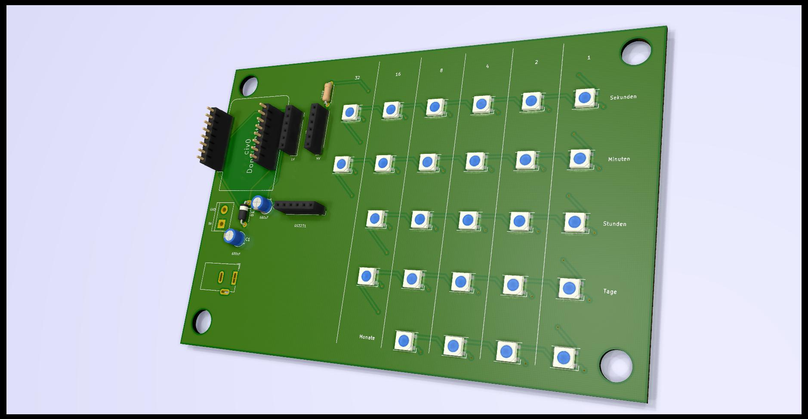

# neopixel-binary-clock
Binary clock using Neopixels, ESP8266 and DS3231 real time clock.

#PCB Design

#idea from civ0
https://github.com/civ0/neopixel-binary-clock

## Timezones
Timeszones are changend with Lib 'Timezones.h'
Everything can be changed with TimeChangeRule.

## Code
Code needs to be cleand up
